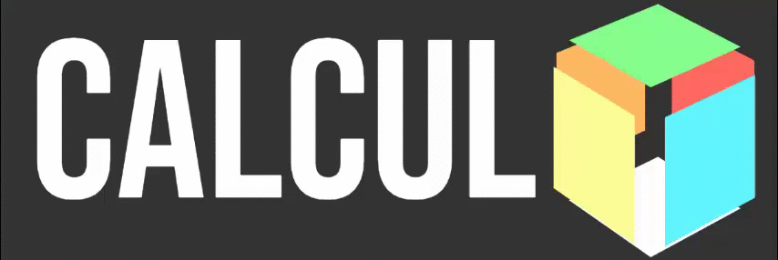

# GRAFICOS EN EL ESPACIO TRIDIMENSIONAL EN LA WEB
El uso del espacio tridimensional es una de los temas mas utilizados en la carrera de Ciencias de la Computacion.¿PORQUE? Es la base de la elaboración de los juegos en 3D por lo que familiarizarnos con conceptos relacionados a este tema es fundamental ya que vamos a hacer uso de los ejes X,Y,Z.

  

## Descripción 📌
Para entender un poco este tema utilize CSS y HTML , para crear una figura 3D en la web , el objetivo es crear una portada de una pagina web y en ella incluir esta figura 3D para ver el uso visual de esta.

## Datos ✒️
* CURSO : Calculo en Varias Variables
* PROFESOR: Mg. Jaime Viza 
